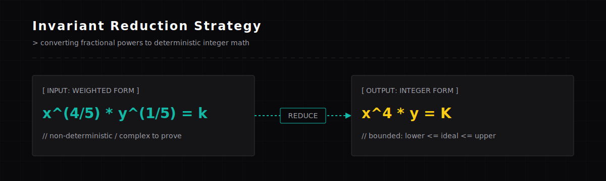
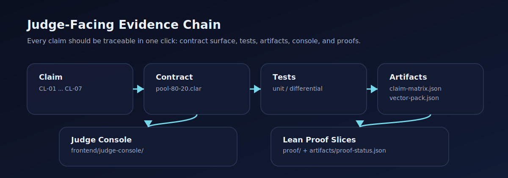
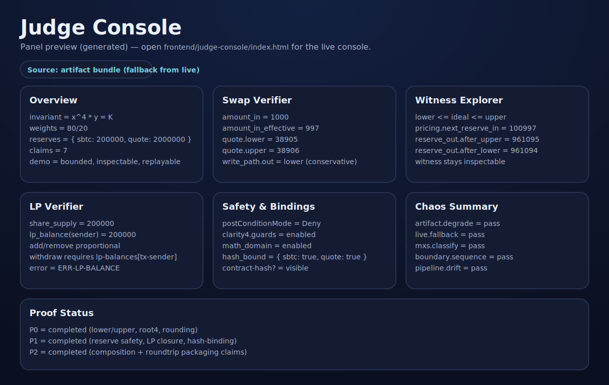

# 🏆 Provable 80/20 sBTC Pool Core

Provable 80/20 sBTC Pool Core is a Stacks / Clarity weighted AMM primitive focused on one narrow claim:

> turn 80/20 weighted BTCFi math into a bounded, integer, provable, demo-ready pool core.

This repo intentionally does **not** try to be a full AMM factory. It keeps the protocol surface small so the correctness surface, witness surface, and hackathon submission surface can be much stronger.

## Judge Mode (Start Here)

If you only have a few minutes, follow this path:

- 30 seconds: open the **Judge Console** and read the invariant reduction (`x^4 * y = K`) + `lower <= ideal <= upper`.
- 90 seconds: pick vector `swap-sbtc-in-1000` and show **Swap Verifier** + **Witness Explorer** (bounds + witness).
- 5 minutes: show **LP Verifier** + **Safety & Bindings**, then open the claim matrix (`docs/claim-matrix.md`) and trace one claim end-to-end.

One-command validation (generates artifacts + runs tests + MXS + proof build):

```bash
npm run validate:full
```

Submission snapshot (commit + tool versions, generated by validation):

- `artifacts/submission-snapshot.json`

Key visuals:





## FAQ (Judge Quick Answers)

**Q: Who can withdraw liquidity?**

- Only addresses with LP shares in `lp-balances` can withdraw. `remove-liquidity` enforces `lp-balances[tx-sender] >= share-amount` and reverts with `ERR-LP-BALANCE`.

**Q: What stops token spoofing / swapping token contracts after init?**

- The pool captures each token’s `contract-hash?` at initialization and enforces hash-binding on all write paths (swap/add/remove), including pure outflow helpers.

**Q: Why do artifacts often show mock tokens instead of official sBTC?**

- Artifact mode is optimized for deterministic replayable vectors. Official sBTC wiring is still proven (CL-06) via the requirement + fixed-height MXS tests, and the console can load an `official sbtc-token (requirement)` dataset offline.

## What It Is

- Single pool only
- Fixed `80/20` weighting
- Fixed `exact-in` swap path
- Proportional LP add/remove only
- Conservative quote path with explicit `lower` and `upper`
- Explicit `uint128` math-domain guard on reserve states
- Clarity 4 guard skeleton + client-side `postConditionMode = Deny`
- sBTC requirement wiring + MXS-ready manifest generation

## Why It Is Innovative

The key reduction is:

```text
80/20 weighted invariant
x^(4/5) * y^(1/5) = k

reduce to integer form
x^4 * y = K
```

That reduction matters because it turns a hard generalized weighted AMM problem into a smaller problem that fits Clarity much better:

```text
general weighted AMM
├─ ln / exp / arbitrary pow are painful to prove and implement
└─ hackathon scope tends to explode

fixed 80/20 pool
├─ sbtc -> quote uses fourth power path
├─ quote -> sbtc uses fourth-root path
├─ witness values stay explicit
└─ conservative rounding is easy to explain to judges
```

## Why Stacks Makes This Possible

- Clarity makes contract execution predictable and inspectable
- Clarity 4 gives in-contract asset guards like `restrict-assets?` and `as-contract?`
- sBTC makes the BTCFi story native to the Stacks ecosystem
- Clarinet + Vitest + MXS make the repo testable and demoable with mainnet realism

## Current Status

Current phase: `week2-live-readonly-evidence-pack`

Implemented now:

- math primitives
- generated `isqrt` / `root4`
- mock SIP-010 assets
- pool initialization with guarded inbound asset movement
- bidirectional readonly quote + witness
- bidirectional swap write path using conservative lower-bound outputs
- proportional LP add/remove
- LP share ownership accounting via `lp-balances` + `get-lp-balance`
- binding status + contract hash inspection
- explicit math-domain guard for reserve / invariant state transitions
- hash-enforced token binding on all write paths (including pure outflow paths and push-out helpers)
- reference model differential tests
- Judge Console artifact hydration + browser-side live readonly mode + explicit degraded-path messages
- sBTC requirement wiring
- MXS manifest generation + fixed-height assertion suite
- P0 / P1 / P2 theorem mapping with passing Lean build
- judge-facing claim matrix artifact + docs
- chaos experiments (L1 artifact, L2 live fallback, L3 remote-data classification, L4 boundary-state sequence, L5 pipeline drift) + `artifacts/chaos-report.json`

Not finished yet:

- additional fixed boundary vectors near multiple edges
- final submission polish and judge-facing packaging (screenshots, 5-minute walkthrough, README polish)

## Repo Map

```text
contracts/
  math-q32.clar
  isqrt64-generated.clar
  pool-80-20.clar
  mock-sbtc.clar
  mock-quote.clar

tests/
  unit/
  differential/
  mxs/
  chaos/

scripts/
  gen_isqrt_contract.py
  gen_artifacts.py
  gen_mxs_manifest.py
  gen_chaos_report.mjs
  chaos-lib.js

sim/
  reference_model.py

frontend/
  judge-console/

artifacts/
  claim-matrix.json
  proof-status.json
  demo-manifest.json
  vector-pack.json
  console-snapshot.json
  chaos-report.json
```

## Demo Flow

1. Show `x^4 * y = K` and explain why fixed 80/20 matters
2. Show readonly quote for `sBTC -> quote`
3. Show witness values proving `lower <= ideal <= upper`
4. Execute the corresponding write-path swap
5. Show guard / binding / contract-hash surfaces
6. Show sBTC requirement and MXS readiness

Detailed demo notes live in `docs/demo-script.md`.

## Safety Model

Three layers are used together:

```text
1. contract logic
   ├─ min reserve checks
   ├─ trade size limits
   ├─ min-out checks
   ├─ explicit uint128 math-domain checks
   └─ conservative lower-bound outputs

2. Clarity 4 asset guards
   ├─ restrict-assets?
   └─ as-contract?

3. client transaction policy
   └─ postConditionMode = Deny
```

More detail: `docs/security-model.md`

## Validation

Core validation commands:

```bash
npm run validate:week1
npm run validate:chaos
npm run validate:full
npm run mxs:check
```

What they cover:

- generated contract stability
- artifacts shape
- `clarinet check`
- unit tests
- differential tests
- chaos tests + chaos report artifact
- MXS smoke manifest path + fixed-height assertion suite

## Judge Console

Static shell entry:

- `frontend/judge-console/index.html`

It reads the local artifact bundle (including `artifacts/vector-pack.json`) and lays out the seven judge-facing panels.

The console is now vector-driven:

- pick a replayable swap / LP vector from the dropdown
- show the expected bounds / witness / LP math from artifacts
- optionally verify the selected vector via browser live readonly against a deployed contract principal

Screenshots / panel preview:


Quick start (artifact mode):

```bash
npm run validate:chaos
python -m http.server 8000
# open http://127.0.0.1:8000/frontend/judge-console/
```

To show official sBTC wiring inside the console (without live readonly):

- Use the **Dataset** selector and choose `official sbtc-token (requirement)`.

The current data path is stronger than a pure mock UI: `scripts/export_console_data.mjs` exports simnet readonly contract data into `artifacts/judge-console-data.json`, `scripts/gen_artifacts.py` generates a replayable vector pack, and the browser UI supports a live readonly mode against a configured Stacks API + deployed contract principal.

The resilience story is now backed by chaos evidence:

- artifact corruption / missing artifacts degrade visibly (no silent success)
- live readonly failures fall back to artifacts (input validation errors do not)
- MXS / remote-data failures are classified as infra (not protocol) in `artifacts/chaos-report.json`

## Submission Docs

- `docs/security-model.md`
- `docs/proof-outline.md`
- `docs/claim-matrix.md`
- `docs/demo-script.md`
- `docs/video-script.md`
- `docs/pitch-outline.md`
- `docs/chaos-matrix.md`

## Next Steps

1. Finish final submission packaging around the live readonly console and claim matrix
2. Record the final demo walkthrough with the live readonly flow
3. Keep widening evidence only where it improves judge confidence more than complexity
